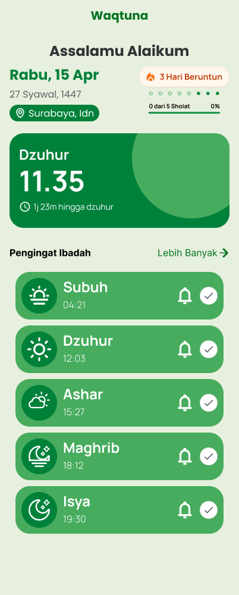
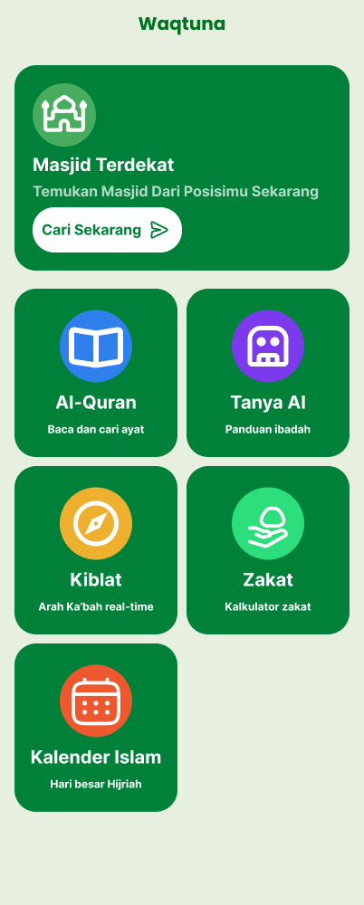

<p align="center">
  
</p>

# Waqtuna

**A complete Islamic worship companion with prayer times, reminders, Quran, and Android widgets.**

[](LICENSE)
[](https://github.com/Ega-Putra/Waqtuna/stargazers)
[](https://github.com/Ega-Putra/Waqtuna/releases/latest)
[](https://x.com/EgaPutraF)

---

## Preview

<p align="center">
  
  
</p>

---

## Why I built this

I wanted a comprehensive Islamic companion app that helps with daily worship while remaining lightweight and respectful of user privacy. The result is **Waqtuna** — your daily Islamic companion with accurate prayer times, reminders, and quick access to Islamic knowledge.

---

## What it can do

- **Accurate prayer times** based on your location using the Adhan algorithm.
- **Smart reminders** for each prayer time notification.
- **Islamic calendar** with Hijri dates and important dates.
- **Al-Quran** browser with surahs and ayahs.
- **Qibla direction** finder with compass integration.
- **Zakat calculator** for your obligatory charity.
- **Android home screen widgets** synced with the app.
- **Offline‑first** storage using AsyncStorage.

---

## How to run

### Development

```bash
npm install
npm run start
```

### Other commands

- `npm run android` — Run on Android emulator/device
- `npm run ios` — Run on iOS simulator/device
- `npm run web` — Run on web browser
- `npm run lint` — Check code quality

### On Android

Download the latest APK from [Releases](https://github.com/Ega-Putra/Waqtuna/releases)

---

### Support the project

Waqtuna is a solo-built Islamic companion app. It's open-source, ad-free, and tracker-free—because your worship journey should remain private and focused.

If this tool has helped you in your daily prayers or kept you connected to Islamic knowledge, please consider:

*   **Giving a Star:** It helps other people find the project.
*   **Spreading the word:** Share it with anyone who wants a private Islamic companion.
*   **Contributing:** Help improve translations, features, or fix bugs.

---

## Under the hood

- **Expo + React Native**
- **Expo Router** for navigation
- **AsyncStorage** for offline persistence
- **Adhan.js** for prayer time calculations
- **react-native-android-widget** for home screen widgets
- **Hijri Date** for Islamic calendar
- **Quran Meta** for Quranic data
- **Expo Sensors** for compass/Qibla direction
- **Ionicons** for iconography

---

## Project Structure

- `app/` — Expo Router routes and wrappers
- `src/features/` — Screens and feature-specific logic
- `src/shared/` — Shared UI components, hooks, constants, utils, and types
- `src/services/` — Service layer for data and API
- `src/theme/` — Design tokens and theme helpers
- `src/widgets/` — Android widget integration

---

## Notes

- Use `@/` alias for imports from `src/`
- Keep app logic within `src/` structure, avoid root-level additions

---

*Made with care by [Ega Putra](https://github.com/ega-putra) & [Radhit Pribadi](https://github.com/radhitchocs)*
